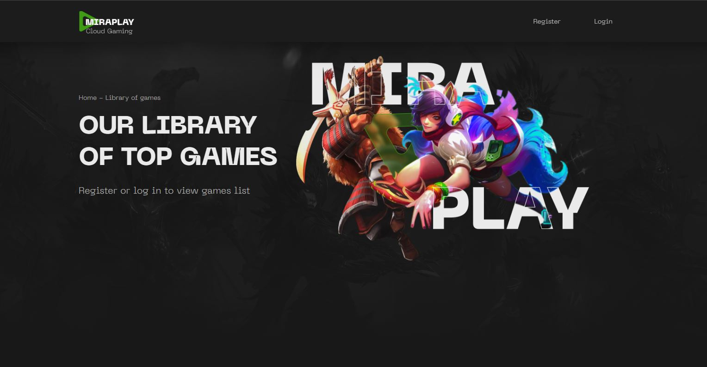

# Miraplay Client

Веб-додаток з авторизацією користувача для перегляду інформації про доступні
ігри з можливістю сортування за жанром та новизною.

[Жива сторінка](https://andrijkarmaza.github.io/miraplay_test_client/games)

## Реалізовано:

- Навігація з публічними та приватними маршрутами.
- Механізми реєстрації та авторизації користувача з відповідними повідомленнями
  про помилки в разі їх виникнення.
- Валідація введених даних при заповненні форм (formik + yup).
- Відправка листа на вказану адресу з посиланням для верицікації користувача.
- Запити на сервери для отримання даних щодо користувача та ігор.
- Збереження даних у глобальний store та local storage.
- Сторінка `Home`. Стартова сторінка з підказкою користувача щодо подальших дій.
- Сторінка `Register`. Сторінка для реєстрації користувача на сайті.
  - форма для заповнення з валідацією даних;
  - після успішної відправки даних з'являється повідомлення про авторизацію та
    про подальші дії;
  - у разі помилки пов'язаної з сервером з'являється відповідне повідомлення.
- Сторінка `Login`. Сторінка для входу зареєстрованого користувача.
  - форма для заповнення з валідацією даних;
  - після успішного входу користувача автоматично перекидає на сторінку `Games`;
  - у разі помилки пов'язаної з сервером або вводі невірних значань з'являється
    відповідне повідомлення.
- Сторінка `Games`:
  - кнопки для сортування списку ігор за жанрами;
  - перемикач для сортування списку ігор за новизною;
  - картки ігор з інформаціїю про них (обложкою, назвою, описом);
  - кнопка "See more" для дозавантаження карток ігор якщо вони є у заданій
    категорії.
- Сторінка `Error`. Сторінка помилки при переході за маршрутом якого не існує.

## Використані технології:

